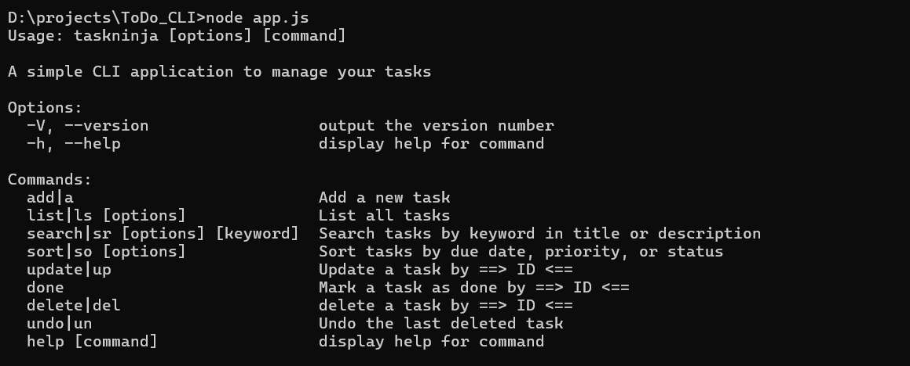
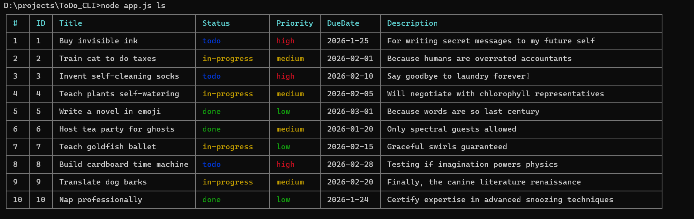
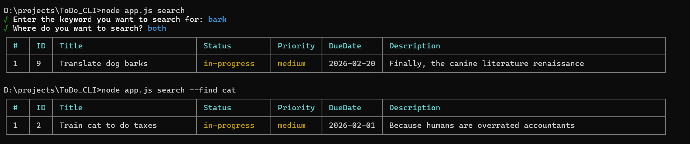
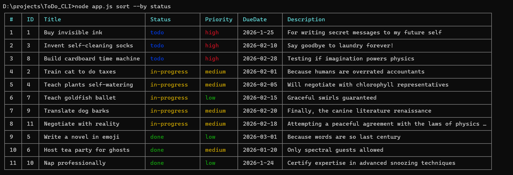

# TaskNinja

**Version:** 1.1.0
**Description:** A simple CLI To-Do Application to manage your tasks directly from the terminal. Includes colored tables, search, soft delete, undo, and interactive sort.

---

## Table of Contents

* [Installation](#installation)
* [Running the CLI](#running-the-cli)
* [Commands](#commands)

  * [Add Task](#add-task)
  * [List Tasks](#list-tasks)
  * [Update Task](#update-task)
  * [Delete Task](#delete-task)
  * [Undo Delete Task](#undo-delete-task)
  * [Search Tasks](#search-tasks)
  * [Sort Tasks](#sort-tasks)
* [Task Fields & Allowed Values](#task-fields--allowed-values)
* [Examples](#examples)
* [Demo](#demo)

---

## Installation

### From npm

TaskNinja is published on npm as `taskninja`. Install it globally to use the CLI commands from anywhere:

```bash
npm install -g taskninja
```

or use it instantly with:

```bash
npx taskninja
npx taskninja <command>
```

Clone the repository and install dependencies:

```bash
git clone <your-repo-url>
cd taskninja
npm install
```

---

## Running the CLI

You can run the CLI using either `node` or the bin aliases:

```bash
# Using node
node app.js <command>

# Using bin aliases
dotask <command>
taskninja <command>
tn <command>
```

Replace `<command>` with any of the available commands: `add`, `list`, `update`, `delete`, `undo`, `search`, `sort`.

---

## Commands

### 1. Add Task

**Alias:** `a`
**Description:** Add a new task interactively.

```bash
tn a
```

**Prompts:**

1. **Task Title:** Enter any text (cannot be empty).

2. **Task Status:** Select from allowed values using arrows:

   * todo
   * in-progress
   * done

3. **Task Priority:** Select from allowed values:

   * low
   * medium
   * high

4. **Due Date:** Enter in `YYYY-MM-DD` format. Invalid dates will show a validation error.

5. **Description:** Optional text.

**Behavior:**

* Task is saved in `todos.json`.
* Confirmation message: `Task added successfully!`

---

### 2. List Tasks

**Alias:** `ls`
**Description:** List all tasks, optionally filtered by status.

```bash
tn ls
tn ls --status todo
```

**Behavior:**

* Displays tasks in a **colored table** using chalk:

| # | ID | Title | Status | Priority | DueDate | Description |
| - | -- | ----- | ------ | -------- | ------- | ----------- |

* Status colors: `todo` → blue, `in-progress` → yellow, `done` → green
* Priority colors: `low` → green, `medium` → yellow, `high` → red

---

### 3. Update Task

**Alias:** `up`
**Description:** Update an existing task by selecting its ID.

```bash
tn up
```

**Steps:**

1. Select task by ID from a list.
2. Confirm which fields to change (title, status, priority, due date, description).
3. Enter new values where applicable.

**Behavior:**

* Only fields selected for change are updated.
* Confirmation message: `Task updated successfully!`
* Shows updated **colored task table**.

---

### 4. Delete Task

**Alias:** `del`
**Description:** Soft delete a task by selecting its ID.

```bash
tn del
```

**Steps:**

1. Select task by ID from a list.
2. Confirm deletion.

**Behavior:**

* Task is removed from `todos.json` **but saved in `deleted-todos.json`**.
* Confirmation: `Task deleted successfully!`
* You can restore it using the `undo` command.

---

### 5. Undo Delete Task

**Alias:** `un`
**Description:** Restore the last deleted task.

```bash
tn un
```

**Behavior:**

* Restores the last deleted task from `deleted-todos.json`.
* Confirmation: `Last deleted task restored successfully!, (Task name: taskName)`

---

Here’s the **Search Tasks** section in the README updated in English after your CLI changes:

---

### 6. Search Tasks

**Alias:** `sr`
**Description:** Search tasks by keyword in title or description.

```bash
# Search interactively
tn search

# Or search directly using --find
tn search --find "meeting"
```

**Behavior:**

* If you run `tn search` without a keyword, the CLI will ask you:

  1. Enter the keyword you want to search for.
  2. Choose where to search: in the title, description, or both.

* If you use `--find <keyword>` directly, the CLI will return all tasks containing that keyword in the title or description.

**Example:**

```bash
tn search
```

```
Enter the keyword you want to search for: meeting
Where do you want to search? (Use arrow keys)
1. title
2. description
3. both
```

```bash
tn search --find "meeting"
```

┌─┬────┬────────────┬─────────────┬─────────┬────────────┬───────────────────┐
│#│ ID │ Title      │ Status      │ Priority│ DueDate    │ Description       │
├─┼────┼────────────┼─────────────┼─────────┼────────────┼───────────────────┤
│1│ 3  │ Team meeting│ todo       │ medium  │ 2026-02-01 │ Discuss project   │
└─┴────┴────────────┴─────────────┴─────────┴────────────┴───────────────────┘

---

### 7. Sort Tasks

**Alias:** `so`
**Description:** Sort tasks interactively by due date, priority, or status.

```bash
tn so
```

**Behavior:**

* Prompts: `Sort tasks by:` → select from `dueDate`, `priority`, `status`.
* Displays **sorted colored table**.
* Can also pass `--by` option: `tn so --by priority`

---

## Task Fields & Allowed Values

| Field       | Allowed Values / Description |
| ----------- | ---------------------------- |
| title       | Any non-empty string         |
| status      | todo, in-progress, done      |
| priority    | low, medium, high            |
| dueDate     | YYYY-MM-DD                   |
| description | Optional text                |

---

## Examples

**Adding a Task:**

```bash
tn a
```

```
Task Title: Buy groceries
Task Status: → todo
Task Priority: → medium
Due Date (YYYY-MM-DD): 2026-02-01
Task Description (optional): Buy fruits and vegetables
```

**Listing Tasks:**

```bash
tn ls
```

```
┌─┬────┬────────────────┬─────────────┬─────────┬────────────┬─────────────────────────────┐
│#│ ID │ Title          │ Status      │ Priority│ DueDate    │ Description                 │
├─┼────┼────────────────┼─────────────┼─────────┼────────────┼─────────────────────────────┤
│1│ 1  │ Buy groceries  │ todo        │ medium  │ 2026-02-01 │ Buy fruits and vegetables  │
└─┴────┴────────────────┴─────────────┴─────────┴────────────┴─────────────────────────────┘
```

**Updating a Task:**

```bash
tn up
```

**Deleting a Task:**

```bash
tn del
```

**Undo Last Deleted Task:**

```bash
tn un
```

**Search Tasks:**

```bash
tn sr groceries
```

**Sort Tasks:**

```bash
tn so
```

* Select `dueDate`, `priority`, or `status` interactively
* Or use `--by` option: `tn so --by priority`

---

## Notes

* All selection prompts use **arrow keys** in terminal.
* Task table always shows **numbered index (`#`) starting from 1**.
* Status and priority are displayed in **colors** for better readability.

---

---

## Demo

**All Features:**



**Adding a Task:**


**Listing Tasks:**



**Updating a Task:**


**Deleting a Task:**


**Restore Last-Deleted Task:**


**Search / Sort Tasks:**





**Mark as Done:**


**Tasks in `todos.json`:**


---

## New Additions for Version `1.1.6`

**ESC Button End Operation:**

* If the user presses the `Esc` button, this will end the ongoing process
* This may benefit the user by terminating the process without having to complete the process until the end
* default setter for date

### SOON
**Auto Deleted Task:**

* When you delete the task, it will remain saved in `deleted_todos.json` for one minute, after which it will be deleted automatically
* This somewhat conserves the user's storage space while calculating that the user may undo deleting a task


