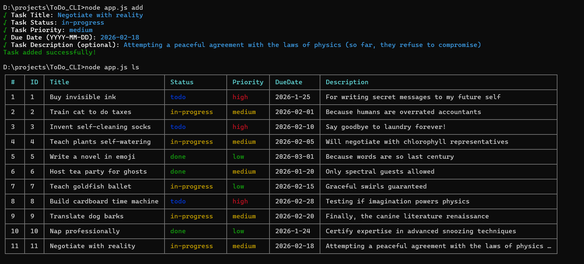
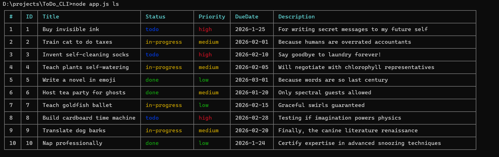
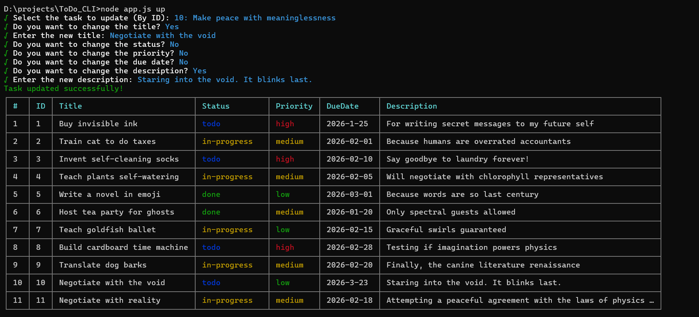
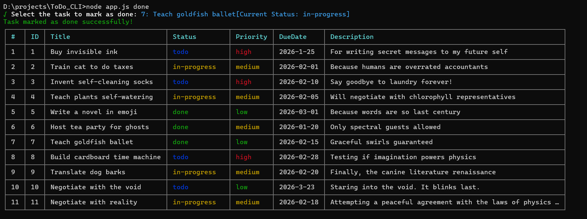
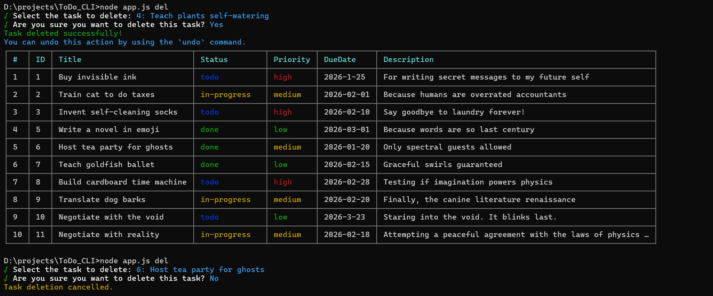
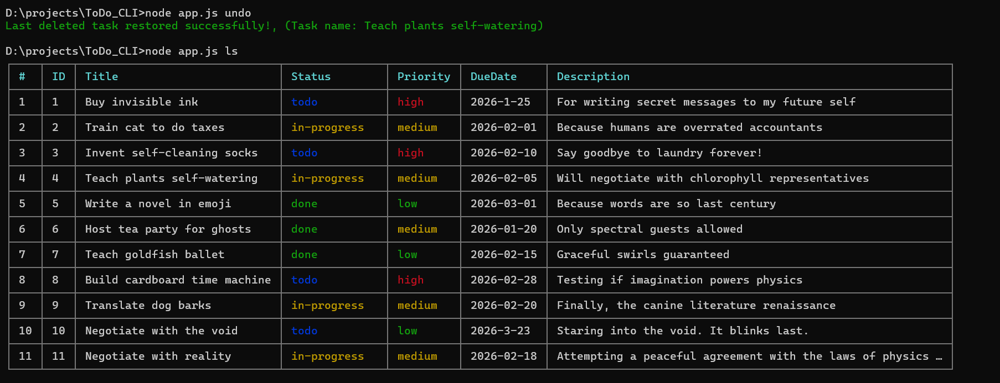
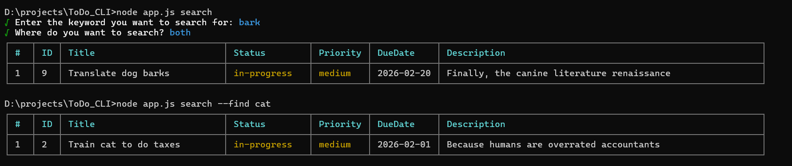
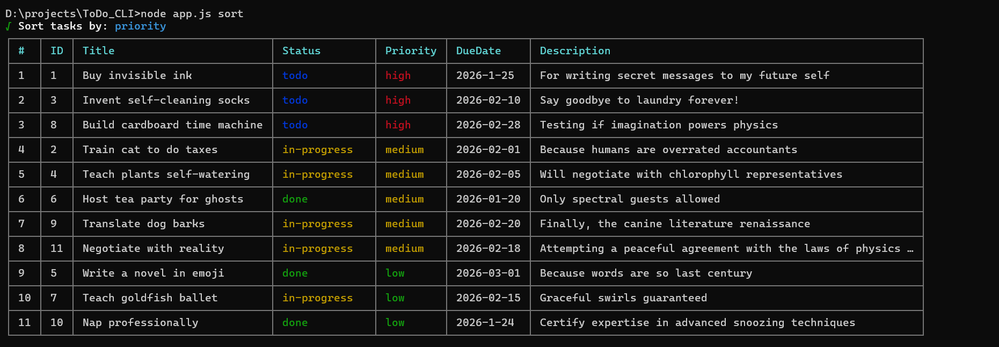
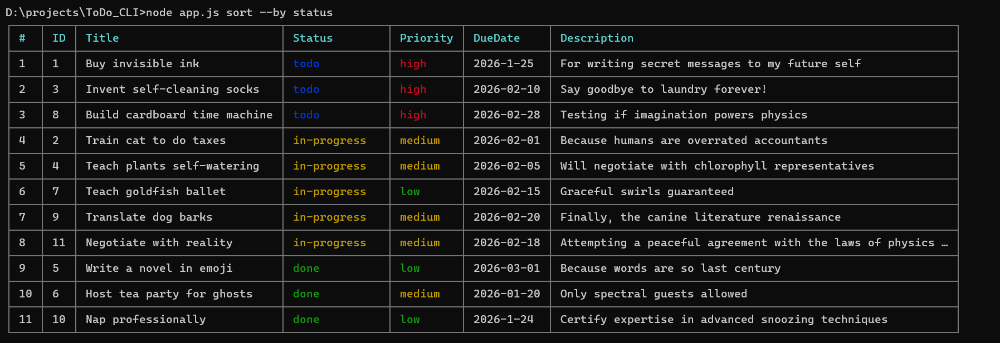
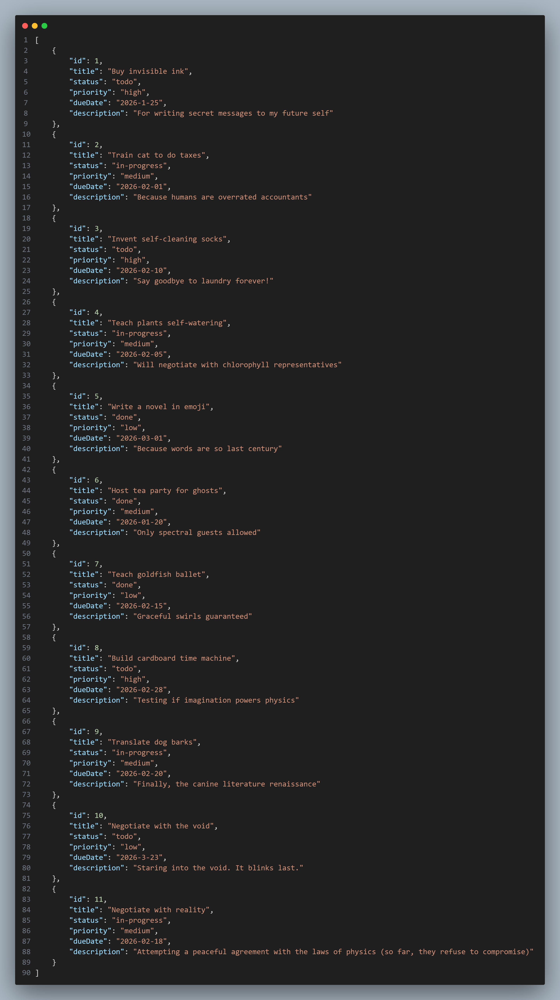

# TaskNinja

**Version:** 1.1.7
**Description:** A simple CLI To-Do Application to manage your tasks directly from the terminal. Includes colored tables, search, soft delete with auto-expiration, undo, and interactive sort.

---

## Table of Contents

* [Installation](#installation)
* [Running the CLI](#running-the-cli)
* [Commands](#commands)
* [Add Task](#1-add-task)
* [List Tasks](#2-list-tasks)
* [Update Task](#3-update-task)
* [Mark as Done](#4-mark-as-done)
* [Delete Task](#5-delete-task)
* [Undo Delete Task](#6-undo-delete-task)
* [Search Tasks](#7-search-tasks)
* [Sort Tasks](#8-sort-tasks)


* [Task Fields & Allowed Values](#task-fields--allowed-values)
* [New Features in Version 1.1.7](#new-features-in-version-117)

---

## Installation

### From npm

TaskNinja is published on npm as `taskninja`. Install it globally to use the CLI commands from anywhere:

```bash
npm install -g taskninja

```

### From Source

Clone the repository and install dependencies:

```bash
git clone <your-repo-url>
cd taskninja
npm install

```

---

## Running the CLI

You can run the CLI using either `node` or the bin aliases:

```bash
# Using bin aliases
tn <command>
taskninja <command>
dotask <command>

# Using node
node index.js <command>

```

---

## Commands

### 1. Add Task

**Alias:** `a`
**Description:** Add a new task interactively.

```bash
tn a

```

**Prompts:**

1. **Task Title:** Enter any text (cannot be empty).
2. **Task Status:** Select from (todo, in-progress, done).
3. **Task Priority:** Select from (low, medium, high).
4. **Due Date:** Enter in `YYYY-MM-DD` (Defaults to today).
5. **Description:** Optional text.



---

### 2. List Tasks

**Alias:** `ls`
**Description:** List all tasks, optionally filtered by status.

```bash
tn ls
tn ls --status todo

```

**Behavior:**

* Displays tasks in a colored table.
* Status colors: `todo` (blue), `in-progress` (yellow), `done` (green).
* Priority colors: `low` (green), `medium` (yellow), `high` (red).



---

### 3. Update Task

**Alias:** `up`
**Description:** Update an existing task by selecting its ID.

```bash
tn up

```

**Steps:**

1. Select task by ID.
2. Confirm which fields to change.
3. Enter new values.



---

### 4. Mark as Done

**Alias:** `done`
**Description:** Quickly mark a specific task as done.

```bash
tn done

```

[Mark Task As Done](src/images/doneTask.png "Mark as Done In one step")



---

### 5. Delete Task

**Alias:** `del`
**Description:** Soft delete a task by selecting its ID.

```bash
tn del

```

**Behavior:**

* Task is moved to `deleted-todos.json` and kept for 60 seconds.



---

### 6. Undo Delete Task

**Alias:** `un`
**Description:** Restore the last deleted task (if within 60 seconds).

```bash
tn un

```



---

### 7. Search Tasks

**Alias:** `sr`
**Description:** Search tasks by keyword in title or description.

```bash
tn search --find "keyword"

```



---

### 8. Sort Tasks

**Alias:** `so`
**Description:** Sort tasks by due date, priority, or status.

```bash
tn so --by priority

```





---

## Task Fields & Allowed Values

| Field | Allowed Values / Description | Requirement |
| --- | --- | --- |
| **Title** | Any non-empty string | Required |
| **Status** | `todo` | `in-progress` | `done` | Required |
| **Priority** | `low` | `medium` | `high` | Required |
| **Due Date** | Date in `YYYY-MM-DD` format | Required |
| **Description** | Any text providing task details | Optional |

---

## New Features in Version 1.1.7

### Smart Cancellation (Ctrl+C)

Operations can now be cancelled using the standard `Ctrl+C` shortcut. This provides a clean exit without overlapping text in the terminal, ensuring a professional user experience.

### Auto-Delete & Expiration

* **Auto-Cleanup:** The CLI automatically deletes `todos.json` or `deleted-todos.json` if they become empty to save space and keep the directory clean.
* **Timed Expiration:** Deleted tasks are stored in `deleted-todos.json` for exactly **60 seconds**. After this period, they are automatically purged to manage storage efficiently.

### Tasks in todos.json

---